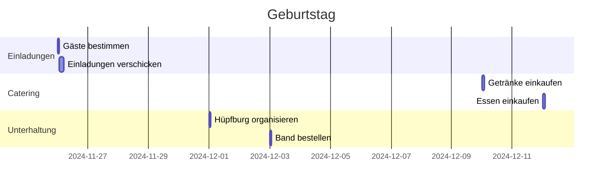

+++
title = "Gantt-Beispiel"
+++

Dies ist ein Beispiel für ein Gantt-Diagramm, das mit [Mermaid](https://mermaid.js.org/syntax/gantt.html) erstellt worden ist:

```mermaid
gantt
    title Geburtstag
    dateFormat DD.MM.YYYY

    section Einladungen
    Gäste bestimmen :p1, 26.11.2024, 1h
    Einladungen verschicken :p2, after p1, 4h

    section Catering
    Getränke einkaufen :c1, 10.12.2024, 2h
    Essen einkaufen :c2, 12.12.2024, 2h

    section Unterhaltung
    Hüpfburg organisieren :u1, 01.12.2024, 1h
    Band bestellen :u2, 03.12.2024, 1h

```